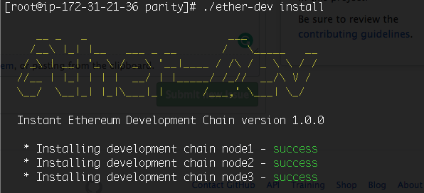
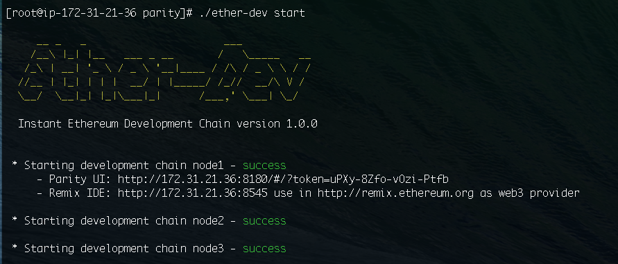
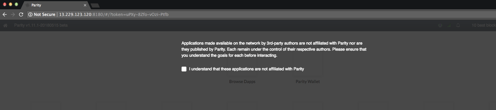
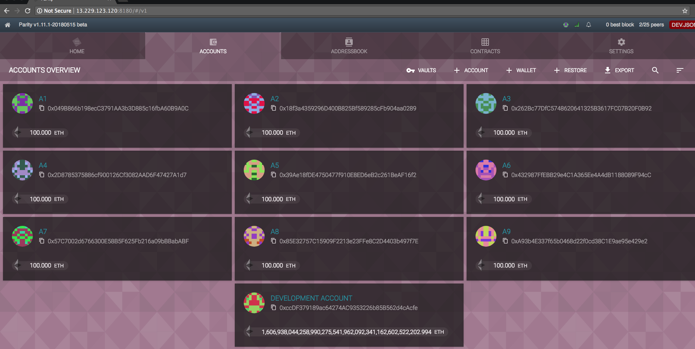
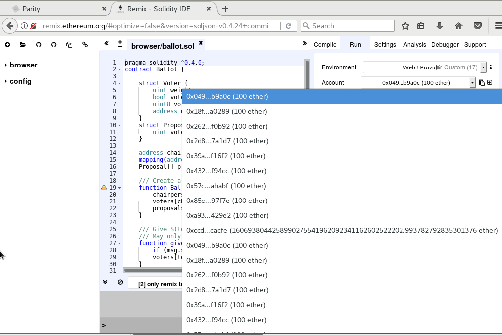
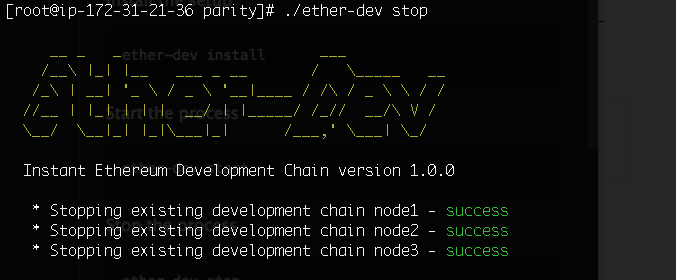
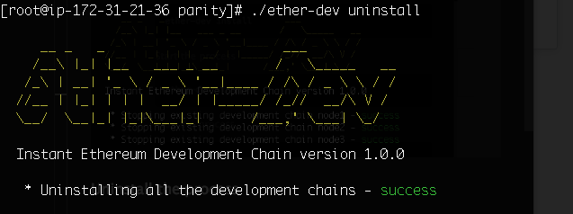

# Using Ether-Dev to create your Private Ethereum Blockchain

Ether-Dev is a command line tool for Mac and Linux to host a 3 node ethereum blockchain with Parity

It will take your current working directory as the base and does the following
when you run it without any command line parameters,

1. If there are any existing blockchain data it will be deleted.
2. Initializes a new chain using `dev.json` with 10 accounts with 100 ether each
3. Three nodes will be created with the folders node1, node2 and node3.
4. Start the chain and
    1. Unlocks first 5 the accounts for easy testing
    2. Remaining 5 accounts can be unlocked with blank password
    2. Exposes RPC interface at http://127.0.0.0:8545
    3. Exposes WebSocket interface at ws://127.0.0.0:8546
    4. Exposes Parity UI interface at http://127.0.0.0:8180
5. Url for the parity ui on your network is provided along with signer token

## Prerequisite

To run Ether-Dev, make sure you have installed [Parity] (https://github.com/paritytech/parity#config-file). If not

1. Install parity using the one-line installer. For more details please refer below
2. Download `ether-dev` script from the repository or clone into the repository
3. Give Execute permission to the script using the command below

          chmod +x ether-dev

4. Now you can perform the tasks as given below

        ether-dev install
        ether-dev start
        ether-dev stop
        ether-dev reset
        ether-dev uninstall

#### Simple one-line installer of parity for Mac and Ubuntu

```bash
bash <(curl https://get.parity.io -Lk)
```

The one-line installer always defaults to the latest beta release. To install a stable release, run:

```bash
bash <(curl https://get.parity.io -Lk) -r stable
```


For more details about parity please refer to the official [website] (https://www.parity.io/)

For details about installation please refer the link for [Parity] (https://github.com/paritytech/parity#config-file)

## Usage

    ether-dev [options] command...
       Performs install and start when command is not specified.
       Commands will be executed one by one in the same order

    COMMANDS:
       install         Create private chain in current working directory
       uninstall       Remove chain from current working directory
       reset           Perform uninstall and install
       start           Start development chain in current working directory
       stop            Stop development chain running in current working directory

    OPTIONS:
       -v | --version  Print version number
       -h | --help     Shows a list of commands and options


### Install the Ethereum Blockchain

    ether-dev install

Terminal looks like below image



### Start the Ethereum Blockchain

    ether-dev start

After starting the process, output is shown as below



1. Open the Parity UI url as shown in your terminal along with given token (eg:http://13.229.123.120:8180/#/?token=EJJU-Zzay-9z6g-OaQF)
    1. After opening the the URL shown in your terminal, it appears as below
    
    2. Click the check box shown, next at the bottom right corner a pop message appears. Select **APPROVE**
    3. Now select **Parity Wallet** icon
    4. The Parity UI will appear like the image below having 10 accounts with 100 ether each.
    
    5. With reference to the above image, Accounts from A1 to A5 are unlocked, but remaining accounts from A5 are locked. The password which is used for unlocking the accounts is Blank password.
    6. Transactions can be made with Accounts from A1 to A5 as they are unlocked, But we need to **Approve** each transaction which are made from A5 to remaining accounts.

2. Open http://remix.ethereum.org under **RUN** go to **Environment** field and select **Web3 Provider** from the drop down list.
3. It prompts for dialog box saying **Are you sure you want to connect to an ethereum node?** select **OK**
4. Now provide the Web3 Provider Endpoint url which is displayed in your terminal for Remix IDE (eg: http://172.31.21.36:8545) and select **OK**
5. Remix is now connected to you dev nodes, where it displays all the 10 accounts created under Accounts field in drop down showing all the accounts having 100 ether each.
6. Solidity contracts can be created using Parity UI or in Remix IDE




### Stop the Ethereum Blockchain


    ether-dev stop

Output looks like the image below



### Reset the Ethereum Blockchain

    ether-dev reset

This resets all the nodes so that you can start the ethereum blockchain again.

Output would be shown as below image


### Uninstall the Ethereum Blockchain

    ether-dev uninstall

Output should appear like below image


